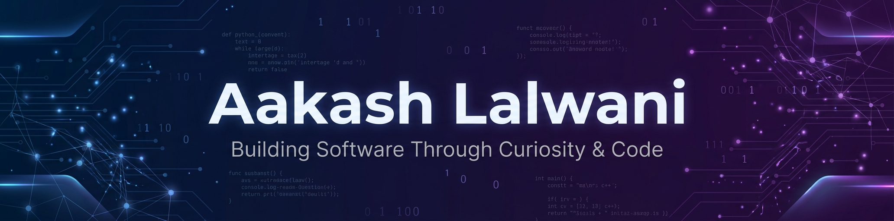

 

### Full Stack Developer • AI/ML Enthusiast

 

---

# 👨‍💻 About Me

🎓 **B.Tech Computer Science & Engineering (AI/ML)** @ VIT Bhopal University | CGPA: 8.63/10.0

💻 I enjoy building modern web applications and intelligent software that solve real-world problems.

🚀 Interested in Full Stack Development, Machine Learning, and Cloud Technologies.

🌱 Currently improving Data Structures & Algorithms while building production-ready applications.

🏆 **Team Lead & Finalist** at ML Mumbai GenAI/ML Hackathon

## 💻 Tech Stack & Tools

  

## 🚀 Featured Projects

<table>

<tr>

<td width="50%" valign="top">

### 🎙️ VoiceCart – Smart Voice Shopping

Voice-powered smart grocery shopping assistant with AI integration.

**✨ Highlights**

- Voice Command Shopping
- Google Gemini AI Integration
- Firebase Firestore Backend
- Responsive React UI

**Built with**

`React` • `TypeScript` • `TailwindCSS`

`Web Speech API` • `Gemini AI` • `Firebase`

 

</td>

<td width="50%" valign="top">

### 🎓 CampusHire – Placement Portal

Full-stack campus placement management system to digitize campus placements.

**✨ Highlights**

- RESTful API Architecture
- Company Onboarding & Drive Creation
- Normalized Database Design
- Student Application Tracking

**Built with**

`React` • `Spring Boot` • `Java`

`MySQL` • `Spring Data JPA`

 

</td>

</tr>

<tr>

<td width="50%" valign="top">

### 📚 LearnLog – AI Study Journal

AI-powered study journal and academic progress tracker for students.

**✨ Highlights**

- PostgreSQL Persistence Layer
- Anomaly Detection Diagnostics
- CI/CD Pipeline Integration
- 50+ Concurrent Users Support

**Built with**

`React` • `Node.js` • `PostgreSQL`

`Jest` • `CI/CD`

 

</td>

<td width="50%" valign="top">

### 🧠 LogicTracer – AI Code Visualizer

AI-powered algorithm visualizer & analytics dashboard with execution tracing.

**✨ Highlights**

- Algorithm Execution Tracing
- Variable State Tracking
- Power BI Dashboard
- LLM API Integration

**Built with**

`Python` • `Plotly` • `LLM APIs`

`Power BI`

 

</td>

</tr>

</table>

---

# 💼 Experience

| Role | Company | Duration |
|------|---------|----------|
| **AI/ML Intern** | MPOnline Limited | May 2026 – Jul 2026 |
| **Digital Marketing Intern** | MPOnline Limited | May 2026 – Jul 2026 |
| **AI & Backend Engineering Intern** | AICTE & Edunet Foundation (IBM SkillsBuild) | Dec 2025 – Jan 2026 |

---

# 🏅 Certifications

 

---

# 📊 GitHub Analytics

---

# 📈 Contribution Activity

---

# 🤝 Let's Connect

---

⭐ Thanks for visiting my profile.

Feel free to connect, collaborate, or explore my repositories.

